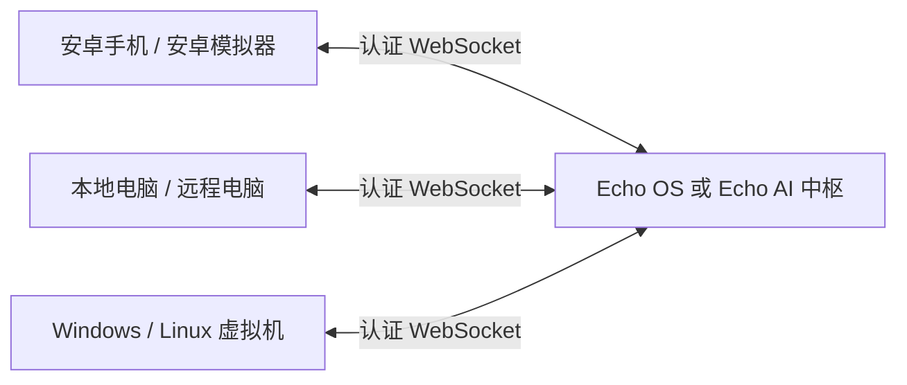

# Echo 统一设备协议与接入

本轮实现协议层互通：Echo Mobile（安卓真机/模拟器）和电脑客户端（实体电脑/虚拟机）连接同一个 Echo 中枢，按设备 ID 双向调用工具并取得执行结果。Echo OS 已包含 Agent runtime；一次部署选择 Echo OS 或独立 Echo AI 作为中枢，不需要把两套中枢串联。本轮没有实现两个独立中枢之间的联邦同步。



## 协议约定

- JSON-RPC 2.0，`protocol_version: "1.0"`；请求参数统一放在 `params`。
- `device/hello` 包含唯一 `tentacle_id`、`auth_token`、`platform`、`device_kind`、`capabilities`。兼容安卓的嵌套 `device_meta` 和旧版平铺元数据；元数据不能覆盖身份或令牌。
- `platform` 为 `android/ios/windows/linux/darwin`；`device_kind` 为 `physical/emulator/vm/unknown`。保留 iOS 协议兼容不代表新增了可部署 iOS 客户端。
- 同型号设备不能共用 ID；克隆虚拟机或模拟器时必须生成新的设备身份。已在线的相同 ID 不会被新连接挤掉。
- 中枢返回 `registered: true` 后客户端才上线；心跳身份绑定已认证连接。
- `device/call` 请求中枢调用目标设备工具，中枢生成独立调用 ID，向目标发送 `tool/execute`，再将真实的 `tool/result` 返回源设备。
- 断线使待处理调用失败，不自动重放动作。超时不代表目标动作已经取消，重试创建文件等动作前应检查结果。
- 屏幕推送继续使用已有消息；`device/screen_changed` 兼容 `device/screen`。本轮不是任意设备之间的实时桌面流转发实现。

示例调用（设备完成握手后发送）：

```json
{
  "jsonrpc": "2.0",
  "id": "request-1",
  "method": "device/call",
  "params": {
    "target_device_id": "vm-1",
    "tool": "workspace.write_text",
    "args": {"path": "from-phone.txt", "text": "来自手机的任务"},
    "timeout_ms": 30000
  }
}
```

成功响应的 `result` 含 `call_id/success/data/duration_ms`；目标执行失败时 `result.success` 为 false，详情在 `result.error`。未授权或参数错误使用顶层 JSON-RPC `error`。调用方必须检查成功标记，不能将收到消息等同于执行成功。

## 先启动一个中枢

**Echo OS：** 按现有部署说明启动，在设备连接页面启用连接并为每个设备分别创建配对邀请。邀请中的 `wsUrl` 和 `token` 是该设备的连接参数；五分钟内首次使用，成功后绑定该设备 ID。撤销配对会断开连接。不要把同一个邀请给多个设备。

远程访问网关健康且设备监听已启用时，邀请会使用 `wss://<网关域名>/api/appliance/device-link/ws`，沿用 HTTPS 网关，不需要把 8765 端口暴露到公网。Tailscale 私网网关要求客户端已加入可访问的网络；设备协议不会自动配置 VPN 或开通云主机。

**独立 Echo AI：** 沿用现有 Tentacle 启动入口，设置 `ECHO_TENTACLE_TOKEN`。设备可以连接 LAN `ws://<中枢内网IP>:8765`，或经过支持 WebSocket Upgrade 的 HTTPS 反向代理连接 `/api/tentacle/device/ws`。后者位于 Tentacle Dashboard 路由所在 HTTP 服务；必须实际启动该路由并配置 TLS。未配置设备认证时，HTTP 网关设备入口拒绝接入。独立 AI 的共享令牌模式没有 OS 的逐设备撤销能力。

仅需要协议开发联调时，可在 AI/OS 仓库虚拟环境中启动最小中枢（不包含对话模型和完整产品界面）：

```python
import asyncio
import os
from runtime.tentacle.coordinator import TentacleCoordinator

async def main():
    hub = TentacleCoordinator(host="127.0.0.1", port=8765,
                              dashboard_port=None,
                              auth_token=os.environ["ECHO_TENTACLE_TOKEN"])
    await hub.start()
    try:
        await asyncio.Event().wait()
    finally:
        await hub.stop()

asyncio.run(main())
```

## 显式授权设备间调用

在**中枢进程**设置 `ECHO_DEVICE_PEER_GRANTS`，然后重启中枢。它是 `源设备ID -> 目标设备ID -> 工具名列表` 的 JSON，默认空列表，不允许跨设备调用。每个方向分别授权，工具名精确匹配，不支持通配符。OS Docker Compose 已透传此变量；写入部署 `.env` 后重新创建服务。

```json
{
  "android-实际设备ID": {
    "vm-1": ["device.info", "workspace.read_text", "workspace.write_text"]
  },
  "vm-1": {
    "android-实际设备ID": ["android.get_screen_info"]
  }
}
```

用设备列表中的实际 ID 和工具名替换示例。授权不会绕过接收设备的本地工具开关、权限或高风险工具确认。安卓远程工具仍走原有不可信来源检查；被策略拦截时返回失败。

## 接入实体电脑和虚拟电脑

在**被操作的电脑或虚拟机内部**准备 AI/OS 仓库的 Python 依赖环境，从仓库根目录启动：

```powershell
$env:ECHO_DEVICE_TOKEN = '<该设备的配对令牌>'
python -m runtime.tentacle.device_client --url 'wss://<网关域名>/api/appliance/device-link/ws' --device-id 'vm-1' --kind vm --workspace 'C:\EchoShare'
```

共享目录必须事先存在。实体电脑使用 `--kind physical`，每台设备使用不同且持久的 `--device-id`。Linux 使用相同命令行选项，路径改为 `/home/user/EchoShare`，令牌放到 `ECHO_DEVICE_TOKEN` 环境变量。

- 默认只开放 `device.info`。
- `--workspace` 开放限定目录内的 UTF-8 文本读取和**创建新文件**，每次最多 64 KiB，禁止越界路径；已有文件不会被覆盖。
- `--screen` 开放 `screen_info/screen_capture`；截图返回 JPEG base64。
- `--allow-input` 额外开放 `mouse_click/keyboard_type`，需安装 PyAutoGUI 并处于有权限的交互桌面会话。无头虚拟机不应启用这些选项。输入目前限 ASCII 文本。
- 客户端主动向中枢建连；设备端不需要开放入站控制端口。远程使用 WSS；明文 WS 仅允许回环或 RFC1918 内网地址。
- Python 集成可启动 `DeviceClient.run_once()` / `run_forever()`，等待 `ready` 后调用 `call_peer(target, tool, args)`。命令行当前用于常驻设备服务，没有额外的单次调用子命令。

## 接入真机和虚拟手机

安卓真机和模拟器安装同一 Echo Mobile APK，打开 Runtime 设置，粘贴 `echo://join?...` 配对连接串（也兼容旧 `octopus://join?...`），或填写邀请中的地址和令牌，然后连接。

Android Studio 模拟器访问宿主机开发中枢可使用 `ws://10.0.2.2:8765`；云手机连接可达的 WSS 网关。各设备仍需授予要使用的无障碍、录屏等权限。只复制 APK，不要复制已配对的应用数据作为新设备身份。

手机新增 `device_call` 工具：`device_id` 是目标 ID，`tool` 是精确工具名，`arguments_json` 是 JSON 对象字符串。它走现有高风险工具流程。协议接通不等于所有自然语言请求已经自动在本地/云端之间调度；是否可调用工具仍由当前 Agent 和模型配置决定。

## 验证范围与现场验收

自动化验证覆盖真实本机 WebSocket、生产电脑客户端写入临时文件、双向调用回传、未授权拒绝、伪造结果拒绝、重复设备 ID、断线重连，以及 OS ASGI 网关配对/撤销。测试中的安卓端是协议夹具；Android 单元测试使用 MockWebServer，不是真实模拟器。

后续实际验收已通过 Windows 实体机、WSL2 Linux 和 Android 15 模拟器的六向工具调用，包括实际 APK、生产 OS 网关、跨系统文件读写和桌面 WSS 证书校验。安卓走开发用 ADB reverse 回环 WS。尚未验收实体手机无障碍操作、桌面截屏/输入、Tailscale 外网 TLS 和真实跨公网设备网络。外部部署验收应依次检查：

1. 两台目标设备各自配对，列表出现不同 ID、正确类型和可用工具。
2. 配置单向 `device.info` 授权，手机调用电脑并获得真实主机名。
3. 开启限定共享目录，手机调用电脑创建文件，去目标机核对内容。
4. 为反向调用单独授权，电脑调用手机实际公布的只读工具并核对结果。
5. 拔网/关客户端后调用失败；重连不重复执行；撤销设备后不能用旧令牌恢复。
6. 在另一个网络重复以上步骤，确认实际 WSS 网关和私网路由可达。

两套仓库中的 `device_protocol.py`、`asgi.py`、`device_client.py` 和协议回归测试目前是同步实现。后续版本升级必须同时运行两套回归；尚未发布独立共享协议包。

## 本轮验证记录（2026-09-25）

| 检查 | 结果 |
| --- | --- |
| Echo AI：设备互通和移动端集成测试 | 21 通过 |
| Echo OS：设备互通、配对、网关、远程访问、认证和屏幕池测试 | 59 通过，2 项 POSIX 启动脚本测试在 Windows 跳过 |
| Android：握手/重连、传输安全、工具风险及 MCP 安全回归 | 51 通过 |
| Android 15 模拟器：实际三端 Instrumentation 验收 | 1 通过，六个方向的工具调用 |
| Android `assembleDebug` | 通过，生成 universal / arm64-v8a / armeabi-v7a / x86_64 APK |
| Android `lintDebug` | 通过，沿用仓库现有 lint baseline，仍有既有告警 |
| Python 本次涉及文件 Ruff | 通过 |
| Android `detekt` | 通过，两个既有问题已通过保持行为的重构解决 |

最初阻挡 Detekt 的函数数量和多跳转循环问题现已解决：无状态图遍历函数移出策略对象，工具注册合并拒绝原因计算。原有 31 项 MCP 描述与生命周期安全测试通过，没有修改 baseline 或禁用规则。本轮选定的测试、Lint、Detekt 和 APK 构建整体命令成功。

Android 测试入口：`OctopusMobileClientHandshakeTest`、`MobileRuntimeSecurityTest`、`ToolRiskPolicyCoverageTest`。后端主要测试入口为 `tests/test_device_interconnect.py`、`tests/test_tentacle_mobile_integration.py`；OS 网关新增覆盖在 `tests/appliance/test_device_link_gateway.py`。

真实环境验收入口是 OS 仓库 `scripts/device_interconnect_lab.py` 和 Mobile 的 `DeviceInterconnectInstrumentedTest`，完整步骤及证据说明在 Mobile 仓库 `INTERCONNECT_ACCEPTANCE.md`。实验室不修改系统证书库或已有服务，测试后已关闭；保留可复用 Android 15 AVD 和构建产物。

本机 JDK 的 Unix socket 临时目录问题通过本次命令的 `JAVA_TOOL_OPTIONS=-Djdk.net.unixdomain.tmpdir=C:/Users/Administrator/.gradle/no-uds-echo-interconnect` 绕开，未修改机器级 Java 配置。正常构建环境无需此参数。


## Android 镜像与文件收发（2026-09-25）

新增设备绑定的 mirror/frame、mirror/control、exchange_files 通道。OS 桌面手机协同窗口已使用真实画面、点击/滑动/中文输入与双向分块文件传输；移除演示数据。Android 文件通过私有收发目录与系统选择器导入导出，12 KiB 分块、100 MiB 单文件上限、SHA-256 校验、上传续传。

Windows 浏览器 → WSL2 OS 网关 → Android 15 APK 实测通过：原生点击、文本与滚动断言；180,017 字节上传、100,013 字节下载、浏览器 20,037 字节往返一致。当前为 JPEG 低帧率刷新；实体手机、远程云手机、高帧率视频与音频尚未验收或实现。详细报告在手机仓库 `PHONE_MIRROR_ACCEPTANCE.md`。
