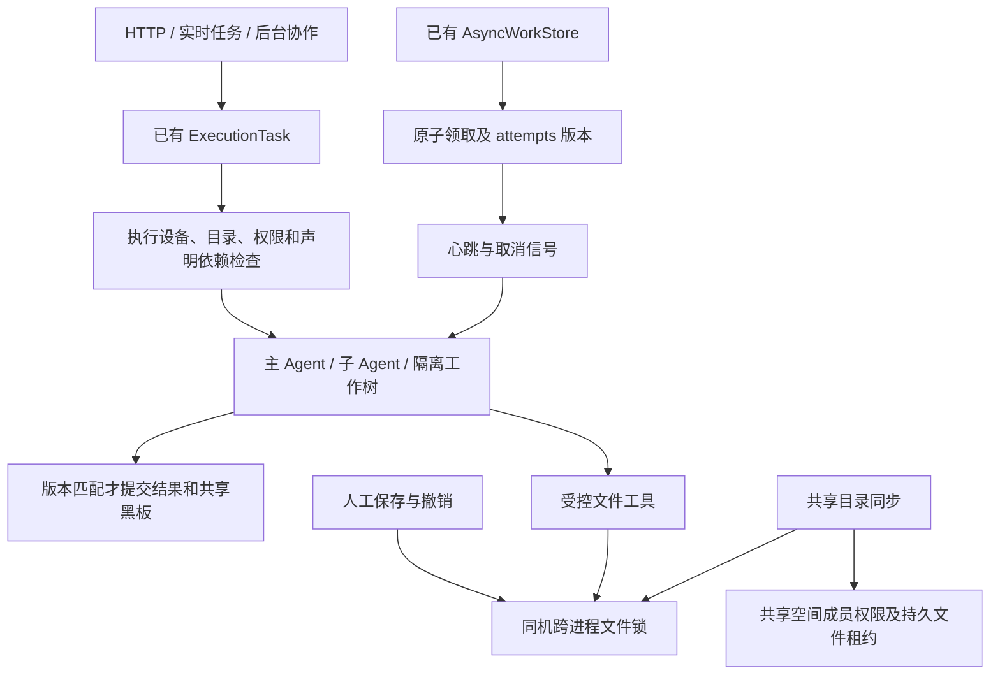

# AX 架构吸收：Echo 执行一致性改进

本轮依据固定版本 Google AX v0.3.0 的代码审计，吸收执行前检查、可回收任务和明确资源归属的思路，直接加强 Echo 已有执行链。没有引入 AX 服务、Redis、Kubernetes，也没有新建一套平行任务队列。这里只记录代码和测试所支持的能力，不以主观重新打分证明超过 AX。

## 已接入的执行链

### 执行前就绪检查

`runtime/execution/environment.py` 定义宿主拥有的 `ExecutionEnvironment`。它随 `ExecutionTask` 进入现有执行作用域，在执行代码进入前检查：

- 目标设备为当前设备（`ECHO_NODE_ID`，未配置时使用主机名），或显式的 `local`。
- 绑定工作目录是已存在、可访问且位于读权限范围内的绝对路径。
- 宿主声明的必要文件存在且没有逃出工作目录，必要命令可在 PATH 中找到。

实时入口和 HTTP/后台宿主入口从已验证的工作目录建立默认声明；子 Agent 保留要求，隔离工作树使用自己的目录。可选依赖由宿主代码声明，尚未增加前端依赖编辑器或安装器。

缺失目录不会在该检查中自动创建，掉线挂载不会被悄悄当作空项目。检查不证明网络盘稍后仍在线、一定可写或远端同步完成，也不能识别已卸载后残留的普通目录是否仍是同一挂载。

### 后台协作任务恢复

沿用 `AsyncWorkStore` 的 SQLite 状态及既有过期回收机制：

- 领取在同一事务中返回任务及本次 `attempts`，避免随后读取到另一个执行器的版本。
- 执行期间定期更新心跳；只有仍处于 working 且版本相同的任务才能续期。
- 完成和失败都附带领取版本校验。旧执行器不能改写新一轮任务、发布黑板结果、更新能力记录或通知完成。
- 心跳失败或归属丢失触发已有取消机制；子 Agent 同时监测持久状态并继承父取消信号。
- 进程停止后心跳自然停止，由既有回收路径重新排队，重试上限仍生效。

这是应用级重试与协作取消，不是恢复原进程内存。已经发出的外部副作用不会自动撤回，不能据此宣称任意工具都能 exactly-once 执行。其他任务引擎还未全部迁移到同一生命周期协议。

### 文件协作

`coordinate_file_mutations` 使用规范化绝对路径和 OS 文件锁，锁文件存放于 Echo 数据目录外置协调区。进程退出后 OS 释放占用。同一线程/异步任务可以嵌套，其他线程、异步任务和进程不能继承其所有权。

接入范围：

- 现有工具执行器能识别单文件目标的文件写入工具；锁在实际工作线程内持有，工具超时返回不会提前释放仍在执行的写入。
- `/api/fs/write` 的本地和远程分支，以及 `/api/fs/revert`、`/api/fs/revert-diff`。
- 共享目录同步的源文件和目标文件；先取得批次所需锁、复核全部内容版本，再执行复制。

工作空间持久文件租约另作加强：获取使用 SQLite 写事务，多个 store 实例不能各自抢到同一文件；接口读租约或获取租约失败时拒绝写入；省略 holder 也不能绕过现有租约。同步遵守持久租约，结束时释放自己新申请的租约，保留之前已有的同持有人租约。共享空间写权限统一为 owner/editor，reviewer 不能作为写成员使用。

这些保护覆盖使用同一 Echo 数据目录的同机协作者。外部编辑器、任意 shell 命令、未接入的工具以及独立设备不能被该锁自动约束；不同挂载别名也不一定解析为同一路径。持久租约还没有统一接入全部原生工具。同一同步批次的每个文件原子替换，但整个批次不是数据库事务；中途 I/O 失败可能留下已复制文件，下次需重新预览。

## 执行取消与续期衔接（2026-09-26）

宿主引擎调用、后台群协作和 ProjectOS 任务现在复用 `ExecutionClaimGuard`：继承上层取消信号、定时续期，遇到领取失效或存储异常时停止后续执行。它不建立新队列；最终结果仍由各自存储在同一个事务中校验执行代次并提交。

后台协作的线程池为每个任务复制调用上下文。上层取消会立即尝试持久化当前代次的取消状态，旧调用的迟到取消不能取消接手任务；执行前已经取消的调用不会领取待办。取消后的返回值和异常均不会写入共享黑板、能力评分或完成回调。心跳覆盖到结果提交，作用域结束后移除上层取消订阅。

ProjectOS 在角色分配、执行和 QA 期间续期，间隔为领取超时的三分之一、最长 5 秒。续期校验任务代次、有效期、项目及里程碑状态；过期领取不能自行复活。最终提交再次事务性检查有效期和父级状态，项目停止后拒绝迟到的输出与 QA 通过结果。失去执行权的任务保留待恢复状态，不自动重放未知副作用。

验证入口：`tests/test_execution_claim_guard.py`、`tests/test_project_execution_claims.py`、`tests/test_cowork_async_runner.py`、`tests/test_execution_lifecycle.py`，以及 ProjectOS、宿主桥接和设备执行回归。覆盖并行取消、旧代次取消、新代次续期、执行及 QA 期间续期、项目停止、存储异常、过期提交和跨租户拒绝。

取消仍是协作式的：不响应取消令牌的外部调用可能继续运行，已发生的外部副作用不会自动回滚，但迟到结果受到存储代次与状态校验约束。这次统一的是执行保护机制，各领域规划、审核及恢复策略仍各自维护；里程碑分解不是本次任务续期的覆盖范围。

## 验收证据与剩余差距

新增故障用例覆盖：进程被杀后释放锁；跨线程、跨异步任务争写；同步前的整批版本复核；工具与人工写入冲突；租约数据库故障；省略 holder；同步撞上成员租约；只读角色；旧领取结果/异常迟到；心跳续期及心跳异常取消；缺失挂载、设备不匹配、越界路径、缺失依赖。

验证入口：`tests/test_execution_environment.py`、`tests/test_file_coordination.py`、`tests/test_file_lease.py`、`tests/test_cowork_async_runner.py`，以及现有文件接口、共享目录、子 Agent 和工具执行器回归测试。

本轮在 Windows/Python 3.11 上完成相关回归：文件接口/工具/子任务上下文一组 84 项通过，隔离工作树 13 项通过，交付验收 24 项通过；环境、队列、租约及同步故障用例也通过。另有一项“运行中删除 SQLite 文件”的既有用例只适用于 POSIX，在 Windows 跳过。修改文件的 Ruff、mypy 零基线检查及运行时不变量检查通过。并行测试已补齐当前 HUB 派发要求的已安装角色测试配置，没有削弱生产角色校验。

2026-09-26 继续落地的设备执行链见 [设备执行与结果回收](execution-nodes.md)：稳定 Workspace ID 的节点目录映射、HTTP 领取/续期、领取代次隔离、丢响应幂等交付、掉线后重新执行、按内容验证并应用交付已接入现有账本；原生/外部引擎进入宿主作用域时登记统一调用记录。新增界面提供设备选择、状态、取消及结果回收。设备任务自动恢复当前限于独立副本内的文件操作。

下面的条目是首次审计时提出的差距，当前状态如下；仍需运行对照验证才能评价集群能力是否超过 AX：

1. Workspace ID、设备授权以及统一输入快照版本已实现；接管使用提交时固定的字节内容，节点不再依赖源目录挂载。自动持续同步仍缺。
2. 共同调用生命周期、设备任务接管和代次校验已实现；各领域计划/审核状态尚未统一，外部引擎远程恢复尚未覆盖。
3. 控制端 HTTP 任务租约、字节交付回执及旧节点拒收已实现并做故障测试；任意外部副作用的幂等回执、全局文件锁和控制端 HA 仍缺。
4. 工作空间成员变化与群协作授权联动，同时保留会话的原有访问边界。
5. 在相同任务、设备和故障条件下与固定版本 AX 运行对照测试，测量成功率、恢复耗时、冲突丢失数及资源占用。

本轮没有重启用户的 Echo 后端或部署多设备服务；运行中的进程需要加载新代码后才能使用改动。
