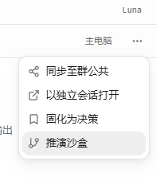

# 成员面板操作简化

范围：用户截图中的成员工作栏及底部跟进输入。

1. 打开成员面板：原先菜单混合了公开发送、独立对话、决策和沙盒。现在去掉菜单，顶部直接显示“分享到群聊”；“主电脑”改为“返回总览”。入口清晰。
2. 私聊：底部只保留一个私聊按钮，输入可选；打开指定成员的独立私聊，已输入文字作为草稿。无群聊发送事件。目的地明确。
3. 分享：仅真实回复可分享；点击放入群聊输入框，用户确认后发送。无回复或只有执行错误时禁用。发布范围明确。

移除的“固化为决策”和“推演沙盒”原先只发送提示文本，并没有相应的保存/创建操作，成功提示存在误导。

验证：97 项前端相关用例通过，2 项原有用例跳过；TypeScript 检查通过。浏览器实际页面已热更新；演示页在 320px 宽度下，面板及关键按钮、输入框均没有横向溢出，已查看完整截图。更新窄侧栏 E2E 用例的按钮断言；本次未运行 Playwright CLI。

边界：仅调整这一处成员面板，未改写历史消息卡片；未发送真实群消息。未声称完成整站无障碍审计。
